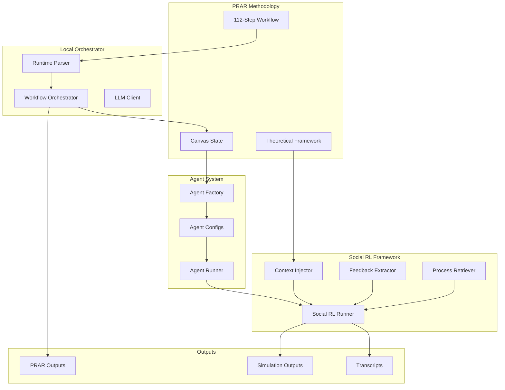
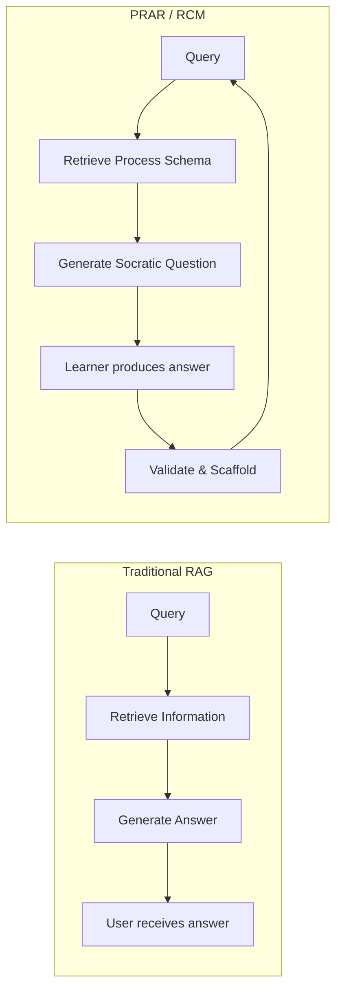
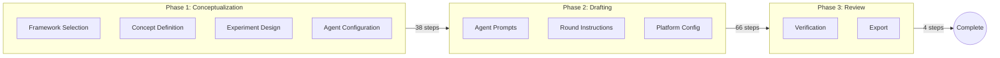

# The Reflect and Connect Model (RCM)

## A Framework for Process-Retrieval Augmented Reasoning in Pedagogical Applications

[]()
[]()
[]()

---

## Abstract

The Reflect and Connect Model (RCM) is a Socratic framework for guiding learners through complex creative tasks without generating content on their behalf. Unlike conventional retrieval-augmented generation (RAG) systems that retrieve information to produce answers, RCM implements Process-Retrieval Augmented Reasoning (PRAR): retrieving procedural schemas that scaffold learner cognition through structured questioning.

This repository contains the reference implementation, experiment infrastructure, and development history of RCM, including its extension to multi-agent simulation through the Social RL framework.

**Deployment**: B42 Chatstorm assignment, University of Toronto

---

## System Architecture



---

## Repository Structure

```
Socratic-RCM/
├── local_rcm/              # Orchestrator engine
│   ├── orchestrator.py     # Workflow state machine
│   ├── canvas_state.py     # Data model and compilation
│   ├── llm_client.py       # LLM abstraction layer
│   ├── runtime-files/      # 3-phase workflow definitions (112 steps)
│   ├── scripts/            # Experiment execution
│   └── tests/              # Automated test suite
│
├── prar/                   # PRAR methodology (formal contribution)
│   ├── configs/            # Reusable configurations
│   ├── templates/          # Baseline answer sets
│   └── outputs/            # Canonical PRAR outputs
│       └── YYYY-MM-DD_*/   # state.json, document.txt, config.json
│
├── agents/                 # Agent system (Phase 1)
│   ├── agent_config.py     # AgentConfig dataclass
│   ├── agent_factory.py    # Canvas-to-agent instantiation
│   ├── agent_runner.py     # Multi-agent simulation runtime
│   └── persona_library/    # Reusable persona templates (planned)
│
├── social_rl/              # Social RL framework (Phase 2.5)
│   ├── runner.py           # Main execution engine
│   ├── context_injector.py # Dynamic manifestation generation
│   ├── feedback_extractor.py # Social feedback extraction
│   └── process_retriever.py  # PRAR policy retrieval
│
├── outputs/                # Social RL experiment outputs
│   └── social_rl_YYYY-MM-DD_*/
│
├── notebooks/              # Canonical notebooks + Colab links
│   ├── baseline_snapshot.ipynb
│   ├── social_rl_demo.ipynb
│   └── README.md
│
├── dual-instance/          # Dual-LLM architecture validation
│   └── dual-instance-v1.ipynb
│
├── production/             # GPT Builder deployment (v8.4)
├── theory/                 # Theoretical knowledge base
├── literature/             # Academic literature
├── docs/                   # Documentation
└── archive/                # Historical versions
```

---

## Core Components

### Local Orchestrator (`local_rcm/`)

Python-based workflow orchestrator executing the 112-step PRAR workflow independently of GPT Builder.

**Characteristics:**
- **State machine architecture**: The orchestrator owns step advancement; the LLM never controls flow
- **LLM-agnostic design**: Supports mock, vLLM, OpenAI API, and Anthropic backends
- **Canvas data model**: Accumulates student responses into a structured representation
- **Deterministic execution**: Same inputs produce identical workflow progression

```bash
cd local_rcm

# Mock mode (no LLM calls)
python scripts/run_baseline_experiment.py --mock

# With vLLM backend
python scripts/run_baseline_experiment.py \
  --base-url http://127.0.0.1:8000/v1 \
  --model Qwen/Qwen2.5-7B-Instruct
```

See [local_rcm/README.md](local_rcm/README.md) for detailed documentation.

### Agent System (`agents/`)

Transforms PRAR canvas definitions into executable simulation participants.

**Components:**
- `AgentConfig`: Configuration dataclass with role, persona, behavioral rules
- `AgentFactory`: Instantiates agents from canvas state files
- `AgentRunner`: Executes multi-agent simulation rounds

```python
from agents import AgentFactory, AgentRunner

factory = AgentFactory.from_state_file("state.json")
agents = factory.create_all()
```

See [agents/README.md](agents/README.md) for usage examples.

### Social RL Framework (`social_rl/`)

Reinforcement learning through social interaction, where agents learn from social dynamics rather than explicit reward functions.

**Key Innovation:** Reframes RL concepts in terms of social interaction:

| Traditional RL | Social RL Equivalent |
|---------------|---------------------|
| Environment | Other agents + theoretical constraints |
| State | Round context + concept manifestations |
| Action | Agent utterance/response |
| Reward | Social feedback (engagement, alignment, contribution) |
| Policy | PRAR process schemas |

**Components:**
- `ContextInjector`: Dynamic per-turn manifestation generation
- `SocialFeedbackExtractor`: Extract learning signals from interaction
- `ProcessRetriever`: PRAR-based reasoning policy retrieval and adaptation
- `SocialRLRunner`: Main execution engine

```python
from social_rl import create_social_rl_runner

runner = create_social_rl_runner('state.json', llm_client, mode='progressive')
results = runner.execute_all_rounds()
```

See [social_rl/README.md](social_rl/README.md) for detailed documentation.

### PRAR Methodology (`prar/`)

The methodological foundation defining Process-Retrieval Augmented Reasoning.

PRAR outputs are the raw products of running the 112-step workflow. Each execution produces:
- `state.json`: Complete workflow state including canvas
- `document.txt`: Human-readable compiled output
- `config.json`: Model, backend, and design metadata

See [prar/README.md](prar/README.md) for the methodology specification.

---

## Theoretical Foundation

### Process-Retrieval vs. Information-Retrieval



| Dimension | Traditional RAG | PRAR (RCM) |
|-----------|-----------------|------------|
| Retrieval target | Information | Process schemas |
| Generation goal | Answers | Scaffolding questions |
| Learner role | Consumer | Producer |
| System constraint | Accuracy | Restraint |

### The RCM Protocol

For each interaction, the system executes:

1. **Reflect**: Identify the pedagogical requirement of the current step
2. **Connect**: Link to relevant theoretical concepts from the knowledge base
3. **Ask**: Pose a Socratic question that advances learner cognition

### Absolute Constraints

The following prohibitions are enforced at the architectural level:

1. The system never writes, rewrites, or paraphrases student content
2. Questions are posed individually; batching is prohibited
3. Placeholder responses (e.g., "TBD", "[...]") are rejected
4. Theory references derive exclusively from provided lecture materials
5. All output is displayed in-chat; no file creation occurs

---

## Three-Phase Workflow

The B42 Chatstorm workflow comprises 112 steps across three phases:



| Phase | Steps | Purpose |
|-------|-------|---------|
| Phase 1 | 38 | Theoretical framework, concepts, agents, setting |
| Phase 2 | 66 | Round instructions, prompts, platform configuration |
| Phase 3 | 4 | Verification and export |

---

## Development Status

### Completed

**Phase 0: Core Infrastructure**
- Full 112-step workflow execution with mock and real LLM backends
- Canvas data model with JSON serialization
- Experiment versioning infrastructure

**Phase 1: Agent Layer**
- Agent configuration dataclass with canvas parsing
- Agent factory for instantiation from state files
- Multi-agent simulation runner with transcript logging

**Phase 2: Dual-LLM Architecture**
- Coach/Performer separation validated in notebook
- Temperature-based role differentiation
- Validation logic for output quality control

**Phase 2.5: Social RL Framework**
- Context injection with dynamic manifestations
- Social feedback extraction (engagement, alignment, contribution)
- Process retrieval as adaptive policy
- Integrated execution runner

### Current Work

- Social RL experimentation with vLLM/Qwen backends
- Local runner optimization (Ollama support)
- Output verification and analysis tooling

### Planned

- **Phase 3**: Dual-LLM client implementation (separate model instances)
- **Phase 4**: Behavioral metrics extraction and analysis
- **Phase 5**: CES agent generation (Canadian Election Study integration)
- **Phase 6**: Publication and reproducibility package

See [ROADMAP.md](ROADMAP.md) for detailed development phases.

### Archived

Previous development branches are preserved in `archive/`:
- `v8_development/`: GPT Builder prompt evolution
- `experimental-bios/`: Split BIOS + Runtime architecture research
- `v3_era/` through `v7_era/`: Historical versions

---

## Documentation

| Resource | Location |
|----------|----------|
| Project overview | This file |
| Development roadmap | [ROADMAP.md](ROADMAP.md) |
| PRAR methodology | [prar/README.md](prar/README.md) |
| Agent system | [agents/README.md](agents/README.md) |
| Social RL framework | [social_rl/README.md](social_rl/README.md) |
| Local orchestrator | [local_rcm/README.md](local_rcm/README.md) |
| Notebooks and Colab links | [notebooks/README.md](notebooks/README.md) |
| Production deployment | [production/README.md](production/README.md) |
| Theoretical knowledge base | [theory/README.md](theory/README.md) |
| Development notes | [WORKING_DOCUMENT.md](WORKING_DOCUMENT.md) |

---

## Quick Start

### Run PRAR Workflow (Mock Mode)

```bash
cd local_rcm
python scripts/run_baseline_experiment.py --mock
```

### Run Social RL Simulation

```bash
# Auto-detects Ollama or OpenAI
python run_social_rl_local.py
```

### View Outputs

PRAR outputs: `prar/outputs/YYYY-MM-DD_*/`
Social RL outputs: `outputs/social_rl_YYYY-MM-DD_*/`

---

## Citation

```bibtex
@misc{coburn2025rcm,
  author = {Coburn, Del},
  title = {The Reflect and Connect Model: Process-Retrieval Augmented Reasoning for Pedagogical Applications},
  year = {2025},
  publisher = {GitHub},
  url = {https://github.com/Baglecake/Socratic-RCM}
}
```

---

## License

See [LICENSE](LICENSE) for terms.

---

## Contact

Del Coburn
University of Toronto
del.coburn@mail.utoronto.ca

For issues or contributions: [GitHub Issues](https://github.com/Baglecake/Socratic-RCM/issues)
