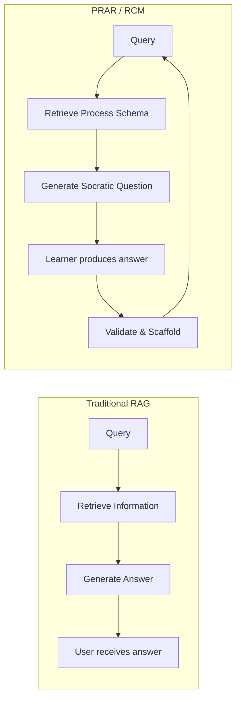

# The Reflect and Connect Model (RCM)

## A Framework for Process-Retrieval Augmented Reasoning in Pedagogical Applications

[]()
[]()

---

## Abstract

The Reflect and Connect Model (RCM) is a Socratic framework for guiding learners through complex creative tasks without generating content on their behalf. Unlike conventional retrieval-augmented generation (RAG) systems that retrieve information to produce answers, RCM implements Process-Retrieval Augmented Reasoning (PRAR): retrieving procedural schemas that scaffold learner cognition through structured questioning.

This repository contains the reference implementation, experiment infrastructure, and archived development history of RCM as applied to the B42 Chatstorm assignment at the University of Toronto.

---

## Repository Structure

```
Socratic-RCM/
├── local_rcm/              # Orchestrator engine
│   ├── orchestrator.py     # Workflow state machine
│   ├── canvas_state.py     # Data model and compilation
│   ├── llm_client.py       # LLM abstraction layer
│   ├── runtime-files/      # 3-phase workflow definitions
│   ├── scripts/            # Experiment execution
│   └── tests/              # Automated test suite
│
├── prar/                   # PRAR methodology (formal contribution)
│   ├── configs/            # Reusable configurations
│   ├── templates/          # Baseline answer sets, agent skeletons
│   └── outputs/            # Canonical PRAR outputs
│       └── YYYY-MM-DD_*/   # state.json, canvas, document
│
├── agents/                 # Agent system (Phase 1)
│   ├── agent_config.py     # AgentConfig dataclass
│   ├── agent_factory.py    # Canvas-to-agent instantiation
│   ├── persona_library/    # Reusable persona templates
│   └── ces_generators/     # CES-to-agent transformation
│
├── experiments/            # Research instances (contextualized runs)
│   └── YYYY-MM-DD_name/    # Notes, analysis, comparisons
│
├── notebooks/              # Canonical notebook + Colab links
│   ├── baseline_snapshot.ipynb
│   └── README.md           # Links to external notebooks
│
├── production/             # GPT Builder deployment (v8.4)
├── theory/                 # Theoretical knowledge base
├── docs/                   # Documentation
└── archive/                # Historical versions
```

---

## Core Components

### Local Orchestrator (`local_rcm/`)

The primary development target is a Python-based workflow orchestrator that executes the 112-step PRAR workflow independently of GPT Builder. Key characteristics:

- **State machine architecture**: The orchestrator owns step advancement; the LLM never controls flow
- **LLM-agnostic design**: Supports mock, vLLM, OpenAI API, and Anthropic backends
- **Canvas data model**: Accumulates student responses into a structured representation
- **Deterministic execution**: Same inputs produce identical workflow progression

**Execution**:
```bash
cd local_rcm

# Mock mode (no LLM calls)
python scripts/run_baseline_experiment.py --mock

# With vLLM backend
python scripts/run_baseline_experiment.py \
  --base-url http://127.0.0.1:8000/v1 \
  --model Qwen/Qwen2.5-7B-Instruct
```

### Experiments Directory (`experiments/`)

Versioned outputs from workflow executions. Each experiment folder contains:

| File | Description |
|------|-------------|
| `state.json` | Complete workflow state including canvas |
| `document.txt` | Human-readable compiled output |
| `config.json` | Model, backend, and design metadata |
| `notes.md` | Execution summary and observations |

### Production System (`production/`)

The GPT Builder deployment (v8.4) remains available for student-facing use. This monolithic prompt architecture embeds the complete workflow in an 8KB system prompt. See [production/README.md](production/README.md) for deployment instructions.

---

## Theoretical Foundation

### Process-Retrieval vs. Information-Retrieval



| Dimension | Traditional RAG | PRAR (RCM) |
|-----------|-----------------|------------|
| Retrieval target | Information | Process schemas |
| Generation goal | Answers | Scaffolding questions |
| Learner role | Consumer | Producer |
| System constraint | Accuracy | Restraint |

### The RCM Protocol

For each interaction, the system executes:

1. **Reflect**: Identify the pedagogical requirement of the current step
2. **Connect**: Link to relevant theoretical concepts from the knowledge base
3. **Ask**: Pose a Socratic question that advances learner cognition

### Absolute Constraints

The following prohibitions are enforced at the architectural level:

1. The system never writes, rewrites, or paraphrases student content
2. Questions are posed individually; batching is prohibited
3. Placeholder responses (e.g., "TBD", "[...]") are rejected
4. Theory references derive exclusively from provided lecture materials
5. All output is displayed in-chat; no file creation occurs

---

## Three-Phase Workflow

The B42 Chatstorm workflow comprises 112 steps across three phases:

**Phase 1: Conceptualization** (38 steps)
- Theoretical framework selection
- Concept definition and contrast
- Experiment design specification
- Agent and setting configuration

**Phase 2: Drafting** (66 steps)
- Agent prompt compilation
- Round instruction development
- Platform configuration
- Helper function setup

**Phase 3: Review** (4 steps)
- Design verification
- Completeness check
- Export preparation

---

## Development Status

### Completed

- Full 112-step workflow execution with mock and real LLM backends
- Canvas data model with JSON serialization
- Experiment versioning infrastructure
- Colab/A100 validation with Qwen 7B via vLLM

### Current Work

- Agent factory abstraction for multi-agent simulation
- RunPod serverless deployment configuration

### Archived

Previous development branches are preserved in `archive/`:
- `v8_development/`: GPT Builder prompt evolution
- `experimental-bios/`: Split BIOS + Runtime architecture research
- `v3_era/` through `v7_era/`: Historical versions

---

## Documentation

| Resource | Location |
|----------|----------|
| Project overview | This file |
| Development roadmap | [ROADMAP.md](ROADMAP.md) |
| PRAR methodology | [prar/README.md](prar/README.md) |
| Agent system | [agents/README.md](agents/README.md) |
| Local orchestrator | [local_rcm/README.md](local_rcm/README.md) |
| Notebooks and Colab links | [notebooks/README.md](notebooks/README.md) |
| Production deployment | [production/README.md](production/README.md) |
| Living development notes | [WORKING_DOCUMENT.md](WORKING_DOCUMENT.md) |

---

## Citation

```bibtex
@misc{coburn2025rcm,
  author = {Coburn, Del},
  title = {The Reflect and Connect Model: Process-Retrieval Augmented Reasoning for Pedagogical Applications},
  year = {2025},
  publisher = {GitHub},
  url = {https://github.com/Baglecake/Socratic-RCM}
}
```

---

## License

See [LICENSE](LICENSE) for terms.

---

## Contact

Del Coburn
University of Toronto
del.coburn@mail.utoronto.ca

For issues or contributions: [GitHub Issues](https://github.com/Baglecake/Socratic-RCM/issues)
