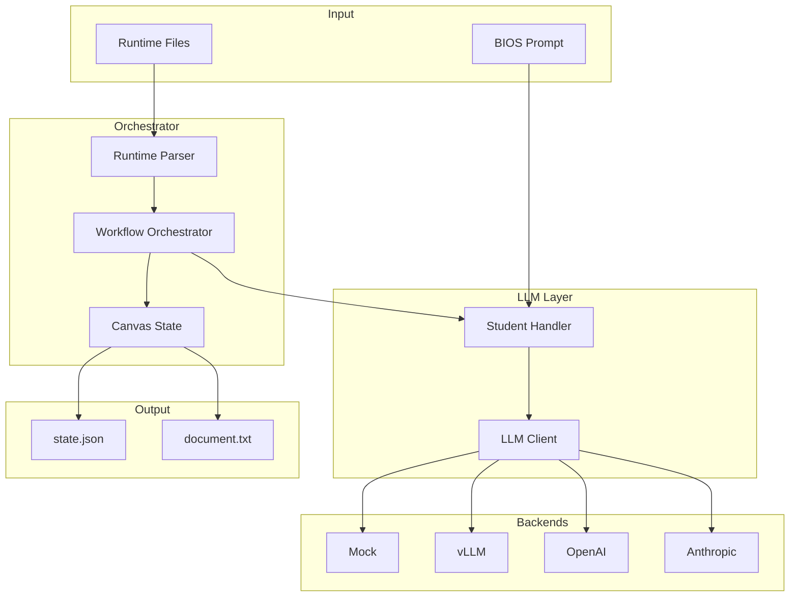
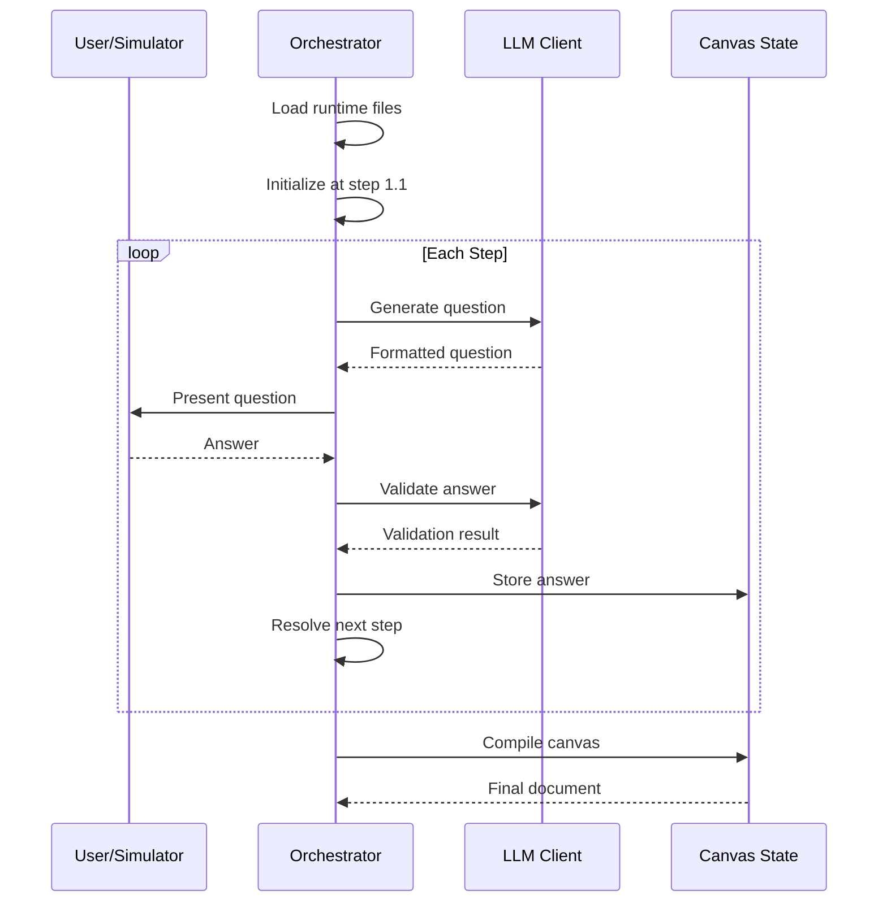
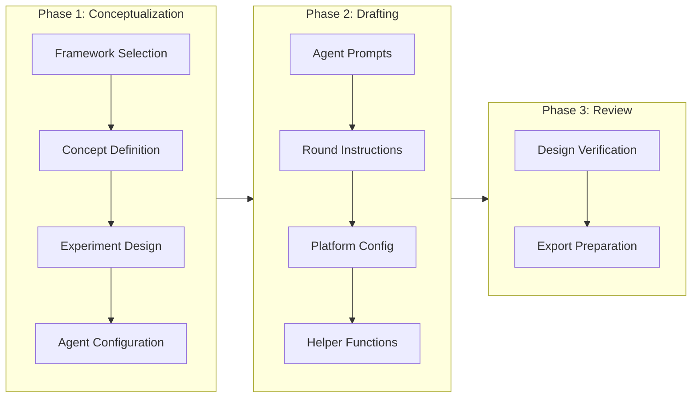
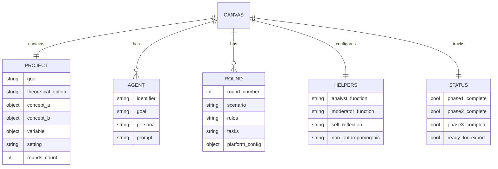

# Local Orchestrator

The local orchestrator executes the 112-step PRAR workflow independently of GPT Builder, providing a Python-based implementation suitable for research, testing, and integration with various LLM backends.

## Architecture



## Workflow Execution



## Directory Structure

```
local_rcm/
├── orchestrator.py       # Workflow state machine (owns step advancement)
├── canvas_state.py       # Data model, compilation, JSON export
├── llm_client.py         # LLM abstraction + StudentSimulator
├── runtime_parser.py     # Step definition parser
├── app.py                # Streamlit web interface
├── example_usage.py      # CLI entry point
├── bios_reduced_prompt.txt
├── requirements.txt
│
├── runtime-files/        # Workflow definitions (56 steps total)
│   ├── B42_Runtime_Phase1_Conceptualization.txt
│   ├── B42_Runtime_Phase2_Drafting.txt
│   └── B42_Runtime_Phase3_Review.txt
│
├── scripts/              # Experiment execution
│   └── run_baseline_experiment.py
│
├── tests/                # Automated test suite
│   ├── test_auto.py
│   ├── test_realistic.py
│   └── test_full_workflow.py
│
└── output/               # Generated outputs (gitignored)
```

## Installation

```bash
cd local_rcm
pip install -r requirements.txt
```

## Usage

### Baseline Experiment (Recommended)

Execute the complete 3-phase workflow with automatic output versioning:

```bash
# Mock mode (no LLM calls, instant execution)
python scripts/run_baseline_experiment.py --mock

# With vLLM backend (requires running vLLM server)
python scripts/run_baseline_experiment.py \
  --base-url http://127.0.0.1:8000/v1 \
  --model Qwen/Qwen2.5-7B-Instruct
```

Outputs are saved to `experiments/YYYY-MM-DD_name/`.

### Streamlit Interface

Interactive web interface for step-by-step execution:

```bash
streamlit run app.py
```

### Test Suite

```bash
# Full workflow (112 steps, mock mode)
python tests/test_full_workflow.py --mock

# Phase 1 only (42 steps)
python tests/test_realistic.py --mock
```

## Three-Phase Workflow



| Phase | Steps | Purpose |
|-------|-------|---------|
| Phase 1 | 38 | Theoretical framework, concepts, agents, setting |
| Phase 2 | 66 | Round instructions, prompts, platform configuration |
| Phase 3 | 4 | Verification and export |

## Canvas Data Model

The canvas accumulates structured data throughout the workflow:



## LLM Backend Configuration

| Backend | Use Case | Configuration |
|---------|----------|---------------|
| Mock | Testing, CI | `--mock` flag |
| vLLM | Local GPU, Colab | `--base-url http://host:8000/v1` |
| OpenAI | API access | `--api-key YOUR_KEY` |
| Anthropic | Claude models | Requires anthropic package |

### vLLM Setup (Colab/RunPod)

```bash
# Start vLLM server
python -m vllm.entrypoints.openai.api_server \
  --model Qwen/Qwen2.5-7B-Instruct \
  --dtype bfloat16 \
  --port 8000

# Run orchestrator
python scripts/run_baseline_experiment.py \
  --base-url http://127.0.0.1:8000/v1 \
  --model Qwen/Qwen2.5-7B-Instruct
```

## Output Files

Each experiment produces:

| File | Description |
|------|-------------|
| `state.json` | Complete workflow state including all student answers and compiled canvas |
| `document.txt` | Human-readable simulation design document |
| `config.json` | Experiment metadata (model, backend, phases completed) |
| `notes.md` | Execution summary and observations |

## Design Principles

1. **Orchestrator owns state**: The LLM never controls workflow progression
2. **Deterministic execution**: Same inputs produce identical step sequences
3. **LLM-agnostic**: Backend can be swapped without code changes
4. **Incremental compilation**: Canvas builds progressively from student responses
